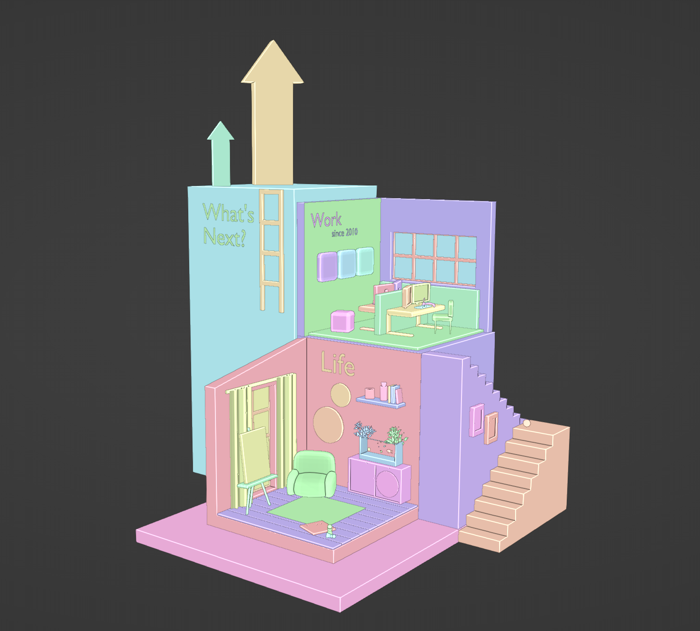
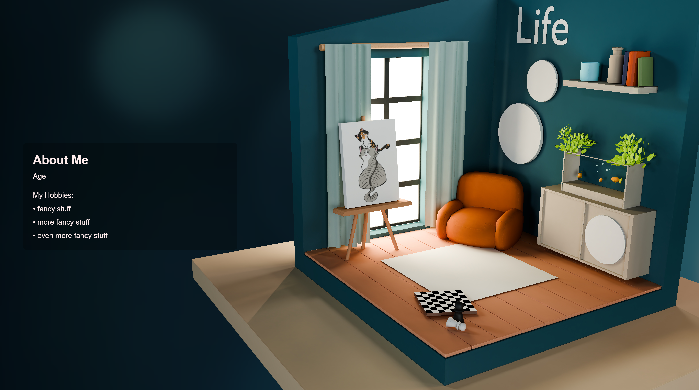

# Welcome to My First GitHub Project: **My Pitch**! 😊

**My Pitch** is a compact website designed to showcase job applications. You can use it as a portfolio site or customize it for other creative purposes.

## 🌐 Live Demo:  
Check it out here: [My Pitch Demo](https://lilithme.github.io/My-Pitch/)

---

## About the Project  
I created the 3D model using **Blender** and integrated it into the website using **Three.js**.  

  

While there’s always room for improvement, I hope this project inspires or helps you in some way. Feel free to tweak, enhance, or adapt it to fit your needs.  

  

---

## Got Ideas?  
If you have any suggestions or feedback, don’t hesitate to reach out. I’d love to hear your ideas for improvement! 😊  

You can contact me on **Discord**: `lilith.me`

---

### Special Thanks  
A big shoutout to **LamaCap** for your incredible help, advice, and patience with a dev newbie like me. Without you, I wouldn’t have even managed to upload this to GitHub! 😅  
